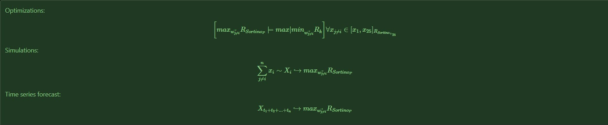

##  S&P 500 Risk Optimizations Forecast

### Description: 

Since Covid, data has changed in most industries with few exceptions and the markets are just another example.<br>

For this reason, the present repository automates tasks that deliver a full understanding until the user *(you)* execution's date. <br>
Furthermore, it generates a variety of optimizations whose purpose is to forecast the mentioned period while being able to incorporate newly generated data with the usage of the snippets provided by the scripts, they could be executed by clicking: <br>

[](https://github.com/EstebanMqz/SP500-Risk-Optimizations-Forecast/blob/main/SP500-Risk-Optimized-Portfolios-ML.ipynb) <br>

#### **Repository Tools:**
<font>
<Details>
<Summary> <b>Click to expand</b> </Summary>

###### Actions: [](https://githubnext.com/projects/repo-visualization)
###### Main Text-Editor: [](https://code.visualstudio.com/)&nbsp;[](https://jupyter.org/try) 

###### Language: [](https://www.python.org)[](https://www.markdownguide.org)[](https://yaml.org)

###### Libraries:  [](https://numpy.org)  [](https://pandas.pydata.org)  [](https://www.scipy.org)  [](https://scikit-learn.org/stable/)  [](https://fitter.readthedocs.io/en/latest/)  [](https://matplotlib.org)  [](https://seaborn.pydata.org)

###### Interface: [](https://create-react-app.dev)

###### Version Control: [](https://github.com)&nbsp;[](https://git-scm.com)  
[](https://github.com/EstebanMqz/Git-Commands)

###### License: [](https://creativecommons.org/licenses/by/3.0/)

</Details>

##### Work Contact:
<font>
<Details>
<Summary> <b>Click to expand</b> </Summary>

[](https://estebanmqz.com) [](https://www.linkedin.com/in/esteban-m65381722210212839/) [](https://estebanmqz.github.io/Portfolio/) [](mailto:esteban@esteban.com)
<br>

 [](https://github.com/EstebanMqz) 

</Details>

##### **Diagram:**
[](https://mango-dune-07a8b7110.1.azurestaticapps.net/?repo=EstebanMqz%2FSP500-Risk-Optimizations-Forecast)


#### Table of Contents: 
The processes made are illustrated by the following:


*Note: Newly generated dataframes is saved in `Data` and visualizations in `Images` folders respectively.* <br>

### Methodology: 

After the Virtual Environment [fn.get_requirements](https://github.com/EstebanMqz/SP500-Risk-Optimized-Portfolios-PostCovid-ML/blob/main/functions.py) is set up and the libraries installed by executing: <br>

```python
fn.library_install("requirements.txt")
```
1. Individual Datasets:

Data Extraction techniques are made for its cleaning and Exploration followed by Descriptive Statistics<br>
$x_i\in [x_1,x_{500}]$ $\hookrightarrow$ $S$&$P$ $500$ and $x_{j\neq i}\in$ $[x_1,x_{25}]_{{R_{Sortino_{+_{25}}}}}$ $\subset$ $x_i$, to show what and how it has happened. <br>

They incorporate to [`pandas.DataFrame.describe`](https://pandas.pydata.org/docs/reference/api/pandas.DataFrame.describe.html) the following variables for Simple $R_t$ and Log Returns $r_t$ in order to be visualized:<br>
+ $\mu_{y}$
+ $\sigma_{y}$
+ $\sum_{t=1}^{n} R_t$ $\&$ $r_t$
+ $VaR_{97.5}$ - $VaR_{2.5}$
+ $MDD$
+ $R_{Sharpe}$, $R_{Sortino}$, $R_{Calmar}$, $R_{Burke}$.<br>

*Visualizations include common periodicity resampling periods.* <br>

As result, the following optimizations are made to subsequently generate simulations with what would have been its past behavior, concluding with the optimization's forecast out of the simulated data: <br>


---
#### **References:**
<font>
<Details>
<Summary> <b>Click to expand</b> </Summary>

##### </u> Pandas: </u> <br>

[`pd.isin`](https://pandas.pydata.org/docs/reference/api/pandas.DataFrame.isin.html) [`pd.df.sample`](https://pandas.pydata.org/pandas-docs/stable/reference/api/pandas.DataFrame.sample.html) [`pd.df.fillna`](https://pandas.pydata.org/pandas-docs/stable/reference/api/pandas.DataFrame.fillna.html) [`pd.df.resample`](https://pandas.pydata.org/pandas-docs/stable/reference/api/pandas.DataFrame.resample.html) [`pandas.DataFrame.describe`](https://pandas.pydata.org/docs/reference/api/pandas.DataFrame.describe.html)

##### </u> Numpy: </u> <br>

[`np.quantile`](https://numpy.org/doc/stable/reference/generated/numpy.quantile.html) [`np.arange`](https://numpy.org/doc/stable/reference/generated/numpy.arange.html) [`np.add`](https://numpy.org/doc/stable/reference/generated/numpy.add.html) [`np.subtract`](https://numpy.org/doc/stable/reference/generated/numpy.subtract.html) [`np.dot`](https://numpy.org/doc/stable/reference/generated/numpy.dot.html) [`np.divide`](https://numpy.org/doc/stable/reference/generated/numpy.divide.html) [`np.cov`](https://numpy.org/doc/stable/reference/generated/numpy.cov.html) [`np.power`](https://numpy.org/doc/stable/reference/generated/numpy.power.html) <br>

##### </u> Stats: </u> <br>

[`scipy.stats`](https://docs.scipy.org/doc/scipy/reference/stats.html) [`scipy.stats.rv_continuous`](https://docs.scipy.org/doc/scipy/reference/generated/scipy.stats.rv_continuous.html) [`scipy.stats.rv_discrete`](https://docs.scipy.org/doc/scipy/reference/generated/scipy.stats.rv_discrete.html) [`scipy.optimize.minimize`](https://docs.scipy.org/doc/scipy/reference/generated/scipy.optimize.minimize.html)

##### </u> Sklearn: </u> <br>

[`sklearn.model_selection.GridSearchCV`](https://scikit-learn.org/stable/modules/generated/sklearn.model_selection.GridSearchCV.html) [`Hyper-parameters Exhaustive GridSearchCV`](https://scikit-learn.org/stable/modules/grid_search.html) <br>

[`sklearn.neighbors.KernelDensity`](https://scikit-learn.org/stable/modules/generated/sklearn.neighbors.KernelDensity.html) [`sklearn.neighbors.KernelDensity.fit`](https://scikit-learn.org/stable/modules/generated/sklearn.neighbors.KernelDensity.html#sklearn.neighbors.KernelDensity.fit) <br>

[`sklearn.neighbors.KernelDensity.score_samples`](https://scikit-learn.org/stable/modules/generated/sklearn.neighbors.KernelDensity.html#sklearn.neighbors.KernelDensity.score_samples) [`sklearn.metrics`](https://scikit-learn.org/stable/modules/model_evaluation.html)

###### Other Libraries: <br>

+ [`fitter`](https://fitter.readthedocs.io/en/latest/index.html)<br>

+ [`statsmodels`](https://www.statsmodels.org/stable/index.html)<br>

###### *Other References*: <br>
+ [`Convolution of Distributions`](https://en.wikipedia.org/wiki/Convolution_of_probability_distributions)
+ [`*i.i.d* $x \sim X$`](https://en.wikipedia.org/wiki/Independent_and_identically_distributed_random_variables)<br>
+ [`LaTeX`](https://en.wikipedia.org/wiki/List_of_mathematical_symbols_by_subject)</br>
+ [`Daily Treasury Par Yield Curve Rates`](https://home.treasury.gov/resource-center/data-chart-center/interest-rates/TextView?type=daily_treasury_yield_curve&field_tdr_date_value_month=202304)<br>
+ [`$S$&$P$ $500$ Symbols`](https://en.wikipedia.org/wiki/List_of_S%26P_500_companies)</br>
