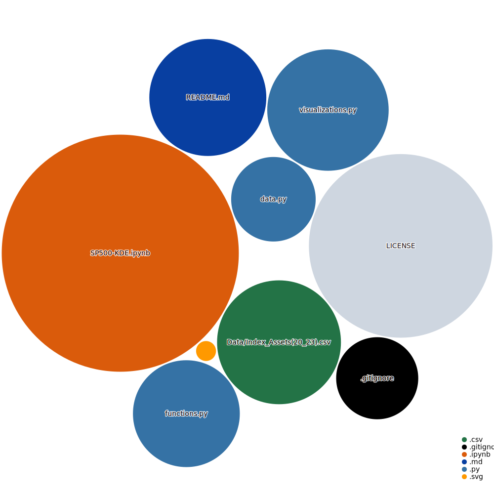

# **SP500-Risk-Optimized-Portfolios-PostCovid-ML**

#### Repository: &nbsp; 

---

### **Diagram:**

 

#### Results: &nbsp; 

---
### **Tools:**
##### Github Action:&nbsp; 
##### Main Text-Editor:&nbsp;&nbsp;
##### Language:&nbsp; 
##### Libraries:&nbsp;&nbsp;&nbsp;&nbsp;&nbsp; 
##### Web-Interface:&nbsp;&nbsp; 
##### Version Control:&nbsp;&nbsp; 
  

##### License:&nbsp; 

If you have any questions or comments, please feel free to send me a message here: 

  

----
#### References:
[Daily Treasury Par Yield Curve Rates](https://home.treasury.gov/resource-center/data-chart-center/interest-rates/TextView?type=daily_treasury_yield_curve&field_tdr_date_value_month=202304) 
[Convolution-of-Distributions](https://en.wikipedia.org/wiki/Convolution_of_probability_distributions) 
[S&P 500 companies](https://en.wikipedia.org/wiki/List_of_S%26P_500_companies) 

---
Libraries: 
###### Numpy:  
[np.add](https://numpy.org/doc/stable/reference/generated/numpy.add.html), &nbsp; [np.subtract](https://numpy.org/doc/stable/reference/generated/numpy.subtract.html), &nbsp; [np.dot](https://numpy.org/doc/stable/reference/generated/numpy.dot.html), &nbsp; [np.divide](https://numpy.org/doc/stable/reference/generated/numpy.divide.html), &nbsp; [np.cov](https://numpy.org/doc/stable/reference/generated/numpy.cov.html) 
###### Stats:  
[scipy.stats](https://docs.scipy.org/doc/scipy/reference/stats.html), &nbsp; [scipy.optimize.minimize](https://docs.scipy.org/doc/scipy/reference/generated/scipy.optimize.minimize.html)  
###### Sklearn:  
[sklearn.model_selection.GridSearchCV](https://scikit-learn.org/stable/modules/generated/sklearn.model_selection.GridSearchCV.html), &nbsp; [Hyper-parameters Exhaustive GridSearchCV](https://scikit-learn.org/stable/modules/grid_search.html) 
[sklearn.neighbors.KernelDensity](https://scikit-learn.org/stable/modules/generated/sklearn.neighbors.KernelDensity.html), &nbsp; [sklearn.neighbors.KernelDensity.fit](https://scikit-learn.org/stable/modules/generated/sklearn.neighbors.KernelDensity.html#sklearn.neighbors.KernelDensity.fit), &nbsp; [sklearn.neighbors.KernelDensity.score_samples](https://scikit-learn.org/stable/modules/generated/sklearn.neighbors.KernelDensity.html#sklearn.neighbors.KernelDensity.score_samples), &nbsp;  
[sklearn.metrics](https://scikit-learn.org/stable/modules/model_evaluation.html) 
