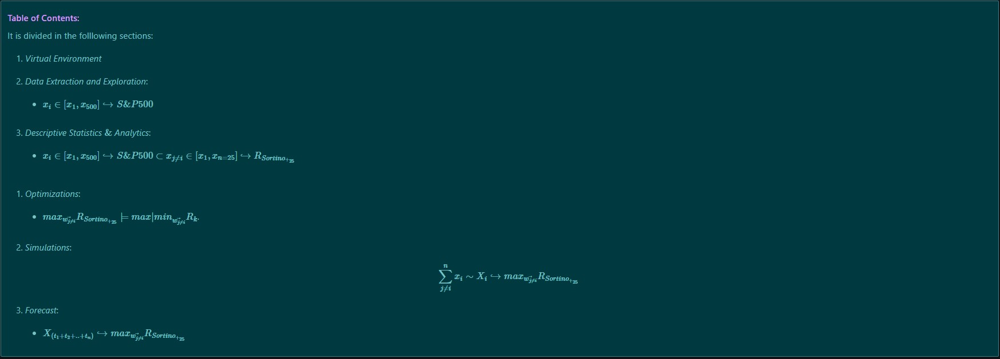

<h1>
<b> Optimized Indexes Forecasts </b>
</h1>

 
 <i>  Click to expand:  </i>

 

    

 

 
 <i>  Repository Tools:  </i> 

###### Actions: 
###### Main Text-Editor: &nbsp;
###### Language:   
###### Libraries:           
###### Interface: 
###### Version Control:  

 
 <i> Files Visualization: </i> 

 

 

 
 <h3>  1.1 Table of Contents:   </h3> 

Sections and processes are illustrated:

 
 <h3>  1.2 Description:   </h3> 
 

[web-app (parser)](https://github.com/EstebanMqz/Optimized_Indexes_Forecasts/blob/c414ca71b86219725a8d55bc03674573faa02087/images/ToC.jpg)

Data has changed since Covid in most industries and the markets project the public's sentiment, financially speaking. 
In this regard, from indexes $OHLCVs$, Volumes $V_{t}$ are standarized and compared dynamically in a web-app to show the big picture of $I$ to the user, as well as to note important insights.  
Moreover, from $Adj_{Closes} \rightarrow P_t$ <i>, its Compounded Returns</i> are manipulated as: $ln({P_t})-ln({P_{t-1}})$ because of their <b>additive nature</b> (instead of multiplicative) 
among other characteristics <i>(see 3.2)</i>, which makes the following true: 
$$\prod_{t=1}^{n}(1+r_t) \implies \bigg[{\mathrm{e}^{\sum_{t=1}^{n} ln (1+r_t) }} \bigg]$$ 

From <i><b>Logarithmic Compounded Returns</b></i> the following are calculated and interpreted <i>(sections 3-7)</i> 

+ Estimators: $\mu_{j_d}, \mu_{j_{Yr}} \mu_{P_d}, \mu_{P_{Yr}}$.
+ Disperssion measures: $Q_n$, $IQR$, $\sigma_{j_d}, \sigma_{j_{Yr}} \sigma_{P_d}, \sigma_{P_{Yr}}$, Correlation $\rho_{i,j}$ and Covariance $\sigma_{i,j}$ matrices. 
+ Optimizations: $R_{Sharpe}$, $R_{Sortino}$, $R_{Calmar}$, $R_{Burke}$, $R_{Kappa}$, $R_{\Omega}$, $R_{Traynor}$, $R_{Jensen}$.
+ Risk measures: $VaR_{\alpha}$, $ES_{\alpha}$, $MDD$. 

Out of the indexes supported, the $S\&P500$ is generally used as benchmark because: 

1. It's the most commonly used index to determine the <i><u>overall state of the economy.</u></i> 
2. Because it has the <i><u>most liquid derivatives markets</u></i> (the same generally applies for $j$ components). 
 *Note: Market Risk exposure hedging won't be covered in this repository.* 
1. Its $j$ components provide a <i><u>broader scope</u></i> to different industries. 

Therefore, $\mathbb{R}^{500} = x_j\in [x_1,x_{500}] \hookrightarrow S\&P500$ is modelled as an example of its usage *(sections 4-7).*

Optimizations Accumulated Returns are obtained, simulated and forecasted from:

$$R^{n \times m} = \sum_{t=1}^{n} \sum_{j=1}^{m} w_{j}\ ln(1+r_t)$$
+ $m$ = No° of components.
+ $j$ = Component
+ $n$ = No° of periods. 
+ $t$ = Period.

 
 <h4>  8. References  </h4> 
 

<h6>

#### Libraries

+ ##### </u> Pandas: </u>  

[`pd.isin`](https://pandas.pydata.org/docs/reference/api/pandas.DataFrame.isin.html) [`pd.df.sample`](https://pandas.pydata.org/pandas-docs/stable/reference/api/pandas.DataFrame.sample.html) [`pd.df.fillna`](https://pandas.pydata.org/pandas-docs/stable/reference/api/pandas.DataFrame.fillna.html) [`pd.df.resample`](https://pandas.pydata.org/pandas-docs/stable/reference/api/pandas.DataFrame.resample.html) [`pandas.DataFrame.describe`](https://pandas.pydata.org/docs/reference/api/pandas.DataFrame.describe.html)

+ ##### </u> Numpy: </u>  

[`np.quantile`](https://numpy.org/doc/stable/reference/generated/numpy.quantile.html) [`np.arange`](https://numpy.org/doc/stable/reference/generated/numpy.arange.html) [`np.add`](https://numpy.org/doc/stable/reference/generated/numpy.add.html) [`np.subtract`](https://numpy.org/doc/stable/reference/generated/numpy.subtract.html) [`np.dot`](https://numpy.org/doc/stable/reference/generated/numpy.dot.html) [`np.divide`](https://numpy.org/doc/stable/reference/generated/numpy.divide.html) [`np.cov`](https://numpy.org/doc/stable/reference/generated/numpy.cov.html) [`np.power`](https://numpy.org/doc/stable/reference/generated/numpy.power.html)  

+ ##### </u> Stats: </u>  

[`scipy.stats`](https://docs.scipy.org/doc/scipy/reference/stats.html) [`scipy.stats.rv_continuous`](https://docs.scipy.org/doc/scipy/reference/generated/scipy.stats.rv_continuous.html) [`scipy.stats.rv_discrete`](https://docs.scipy.org/doc/scipy/reference/generated/scipy.stats.rv_discrete.html) [`scipy.optimize.minimize`](https://docs.scipy.org/doc/scipy/reference/generated/scipy.optimize.minimize.html)

+ ##### </u> Sklearn: </u>  

[`sklearn.model_selection.GridSearchCV`](https://scikit-learn.org/stable/modules/generated/sklearn.model_selection.GridSearchCV.html) [`Hyper-parameters Exhaustive GridSearchCV`](https://scikit-learn.org/stable/modules/grid_search.html)  
[`sklearn.neighbors.KernelDensity`](https://scikit-learn.org/stable/modules/generated/sklearn.neighbors.KernelDensity.html) [`sklearn.neighbors.KernelDensity.fit`](https://scikit-learn.org/stable/modules/generated/sklearn.neighbors.KernelDensity.html#sklearn.neighbors.KernelDensity.fit)  
[`sklearn.neighbors.KernelDensity.score_samples`](https://scikit-learn.org/stable/modules/generated/sklearn.neighbors.KernelDensity.html#sklearn.neighbors.KernelDensity.score_samples) [`sklearn.metrics`](https://scikit-learn.org/stable/modules/model_evaluation.html)

+ ##### Other:  

[`fitter`](https://fitter.readthedocs.io/en/latest/index.html) 
[`statsmodels`](https://www.statsmodels.org/stable/index.html)  

+ ##### Other References:  

###### *Indexes Supported*: 

+ [`S&P`](https://en.wikipedia.org/wiki/List_of_S%26P_500_companies) [`Dow Jones`](https://en.wikipedia.org/wiki/Dow_Jones_Industrial_Average) [`NASDAQ 100`](https://en.wikipedia.org/wiki/NASDAQ-100) [`Russell 1000`](https://en.wikipedia.org/wiki/Russell_1000_Index) [`FTSE 100`](https://en.wikipedia.org/wiki/FTSE_100_Index) [`IPC`](https://en.wikipedia.org/wiki/Indice_de_Precios_y_Cotizaciones) [`DAX`](https://en.wikipedia.org/wiki/DAX) [`IBEX 35`](https://en.wikipedia.org/wiki/IBEX_35) [`CAC 40`](https://en.wikipedia.org/wiki/CAC_40) [`EURO STOXX 50`](https://en.wikipedia.org/wiki/EURO_STOXX_50) [`FTSE MIB`](https://en.wikipedia.org/wiki/FTSE_MIB) [`Hang Seng Index`](https://en.wikipedia.org/wiki/Hang_Seng_Index)

###### *Official Market Risks Data:*

+ [`Daily Treasury Par Yield Curve Rates`](https://home.treasury.gov/resource-center/data-chart-center/interest-rates/TextView?type=daily_treasury_yield_curve&field_tdr_date_value_month=202304) 
+ [`Bank of International Settlements (BIS)`](https://www.bis.org/statistics/index.htm) 

###### *Other:*

+ [`LaTeX`](https://en.wikipedia.org/wiki/List_of_mathematical_symbols_by_subject) 
+ [`Expected Shortfall (ES)`](https://en.wikipedia.org/wiki/Expected_shortfall) [`Value at Risk (VaR)`](https://en.wikipedia.org/wiki/Value_at_risk)
+ [`Convolution of Distributions`](https://en.wikipedia.org/wiki/Convolution_of_probability_distributions) 
+ [`i.i.d`](https://en.wikipedia.org/wiki/Independent_and_identically_distributed_random_variables) 

+ [`Expected Shortfall (ES)`](https://en.wikipedia.org/wiki/Expected_shortfall) 
