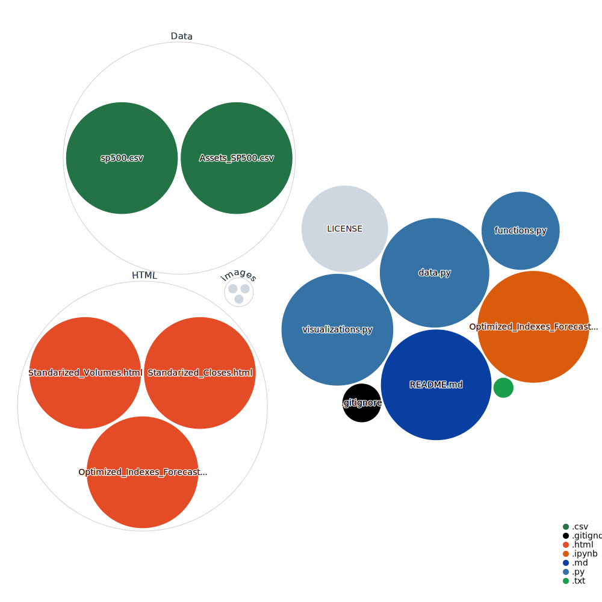

<h1><div align="center"><font color= '#318f17'><b> Optimized Indexes Forecasts </b></font></div></h1>

<div align="right">

[](https://creativecommons.org/licenses/by/3.0/)

<Details> <Summary> <i> <font color= '#ff9100'> Click to expand: </font> </i>

 </Summary>

[](https://estebanmqz.com) [](https://www.linkedin.com/in/esteban-m65381722210212839/) [](https://estebanmqz.github.io/Portfolio/) [](mailto:esteban@esteban.com)</br>

 [](https://github.com/EstebanMqz)
</Details>

<Details> <Summary> <i> <font color= '#ff9100'> Repository Tools: </font> </i> </Summary>

###### Actions: [](https://githubnext.com/projects/repo-visualization)
###### Main Text-Editor: [](https://code.visualstudio.com/)&nbsp;[](https://jupyter.org/try)
###### Language: [](https://www.python.org)[](https://www.markdownguide.org)[](https://yaml.org)  
###### Libraries: [](https://numpy.org)  [](https://pandas.pydata.org)  [](https://www.scipy.org)  [](https://fitter.readthedocs.io/en/latest/)  [](https://matplotlib.org)  [](https://seaborn.pydata.org)
###### Interface: [](https://create-react-app.dev)
###### Version Control: [](https://git-scm.com) [](https://github.com/EstebanMqz/Git-Commands)
</Details>
</div>
<Details> <Summary> <i> <font color= 'orange'> Files Visualization: </font> </i> </Summary>

[](https://mango-dune-07a8b7110.1.azurestaticapps.net/?repo=EstebanMqz%2FOptimized_Indexes_Forecasts) [](https://nbviewer.org/github/EstebanMqz/Optimized_Indexes_Forecasts/blob/main/Optimized_Indexes_Forecasts.ipynb)



</Details> 

<Details> <Summary> <h3> <font color= '#3d74eb'> 1.1 Table of Contents:  </font> </h3> </Summary>

Sections and processes are illustrated:


</Details>

<Details> <Summary> <h3> <font color= '#3d74eb'> 1.2 Description:  </font> </h3> </Summary> 

Data has changed since Covid in most industries and the markets project the public's sentiment, financially speaking.<br>
In this regard, from indexes OHLCVs, Volumes are standarized and compared dynamically in a web-app to show the big picture of indexes supported to the user, as well as to note important insights.<br> 

[App-Markdown](https://github.com/EstebanMqz/Optimized_Indexes_Forecasts/blob/main/images/Description.jpg)<br>
Moreover, from $Adj_{Closes} \rightarrow P_t$ returns $r_t$ are obtained and </i> manipulated as: $ln({P_{t+1}})-ln({P_{t}})$ because of their <b>additive nature</b> among other characteristics, which transforms the multiplicative nature of <b>Compounded Returns</b> <i>(see 3.2)</i>:
$$\prod_{t=1}^{n}(1+r_t) \implies \bigg[{\mathrm{e}^{\sum_{t=1}^{n} ln (1+r_t) }} \bigg]$$ 

From $ln(1+r_t)$ the following are calculated and interpreted <u><i>(sections 3-7)</i></u>:

+ Estimators: $\mu_{j_d}, \mu_{j_{Yr}} \mu_{P_d}, \mu_{P_{Yr}}$.
+ Disperssion measures: $Q_n$, $IQR$, $\sigma_{j_d}, \sigma_{j_{Yr}} \sigma_{P_d}, \sigma_{P_{Yr}}$, Correlation $\rho_{i,j}$ and Covariance $\sigma_{i,j}$ matrices.<br>
+ Optimizations: $R_{Sharpe}$, $R_{Sortino}$, $R_{Calmar}$, $R_{Burke}$, $R_{Kappa}$, $R_{\Omega}$, $R_{Traynor}$, $R_{Jensen}$.
+ Risk measures: $VaR_{\alpha}$, $ES_{\alpha}$, $MDD$.<br>

Considering, the $SP500$ is generally used as benchmark because:<br>

1. It's the most commonly used index to determine the <i><u>overall state of the economy.</u></i><br>
2. It has the <i><u>most liquid derivatives markets</u></i> (the same generally applies for $j$ components).<br>
 *Note: Market Risk exposure hedging won't be covered.*<br>
1. Its components provide a <i><u>broader scope</u></i> to industries.<br>

Out of the indexes supported, it will be modelled as an example <u><i>(sections 4-7)</i></u>:<br>
$\mathbb{R}^{500}$ = $x_j\in [x_1,x_{500}] \hookrightarrow SP500$.

Starting from its Optimizations $R^{n \times m}$:

$$R^{n \times m} = \sum_{t=1}^{n} \sum_{j=1}^{m} w_{j}\ ln(1+r_t)$$
+ $m$ = No° of components.
+ $j$ = Component
+ $n$ = No° of periods. 
+ $t$ = Period.

And concluding with their Simulations and Forecasts.

</Details>

<Details> <Summary> <h3> <font color= '#3d74eb'> 2. Requirements:  </font> </h3> </Summary> 

Import files with `.py` extension in cwd callable as a list.

``` python
import glob
mod = [__import__(name[:-3]) for name in glob.glob('*.py')]
```

Generate [`requirements.txt`](https://github.com/EstebanMqz/Optimized_Indexes_Forecasts/blob/main/requirements.txt) file with latest versions of libraries used in project.

```python
!pipreqs --encoding utf-8 "./" --force
mod[1].get_requirements(docstring)
with open(glob.glob('*.txt')[0], 'r') as file: print(file.read())
```

Install the packages in environment and import libraries <i>(refer to 2.2)</i>.

```
%%capture
!pip install -r requirements.txt
```

</Details>

<Details> <Summary> <h3> <font color= '#3d74eb'> 3. Data Extraction and Exploration:  </font> </h3> </Summary>

Data is extracted for indexes an saved in an html <u><i>embed dataframe</i></u>: [`OHCLV-web`](https://htmlpreview.github.io/?https://github.com/EstebanMqz/Optimized_Indexes_Forecasts/blob/main/HTML/adjindex.html) *(see refs.)*.<br>
Volumes are standarized and compared dynamically in an html <u><i>embed plot</i></u>: [`Plotly-web-app`](https://htmlpreview.github.io/?https://github.com/EstebanMqz/Optimized_Indexes_Forecasts/blob/main/HTML/Standarized_Volumes.html).<br>

As an example of its usage, an image of its features is captured by selecting the NASDAQ and the SP500: 


<i>Nasdaq relative volume have sustained at much higher levels than the benchmark since Covid for example.</i>

</Details>

<Details> <Summary> <h3> <font color= '#3d74eb'> 8. References </font> </h3> </Summary> 

<font color= 'white'><h6>

#### Libraries

+ ##### </u> Pandas: </u> <br>

[`pd.isin`](https://pandas.pydata.org/docs/reference/api/pandas.DataFrame.isin.html) [`pd.df.sample`](https://pandas.pydata.org/pandas-docs/stable/reference/api/pandas.DataFrame.sample.html) [`pd.df.fillna`](https://pandas.pydata.org/pandas-docs/stable/reference/api/pandas.DataFrame.fillna.html) [`pd.df.resample`](https://pandas.pydata.org/pandas-docs/stable/reference/api/pandas.DataFrame.resample.html) [`pandas.DataFrame.describe`](https://pandas.pydata.org/docs/reference/api/pandas.DataFrame.describe.html)

+ ##### </u> Numpy: </u> <br>

[`np.quantile`](https://numpy.org/doc/stable/reference/generated/numpy.quantile.html) [`np.arange`](https://numpy.org/doc/stable/reference/generated/numpy.arange.html) [`np.add`](https://numpy.org/doc/stable/reference/generated/numpy.add.html) [`np.subtract`](https://numpy.org/doc/stable/reference/generated/numpy.subtract.html) [`np.dot`](https://numpy.org/doc/stable/reference/generated/numpy.dot.html) [`np.divide`](https://numpy.org/doc/stable/reference/generated/numpy.divide.html) [`np.cov`](https://numpy.org/doc/stable/reference/generated/numpy.cov.html) [`np.power`](https://numpy.org/doc/stable/reference/generated/numpy.power.html) <br>

+ ##### </u> Stats: </u> <br>

[`scipy.stats`](https://docs.scipy.org/doc/scipy/reference/stats.html) [`scipy.stats.rv_continuous`](https://docs.scipy.org/doc/scipy/reference/generated/scipy.stats.rv_continuous.html) [`scipy.stats.rv_discrete`](https://docs.scipy.org/doc/scipy/reference/generated/scipy.stats.rv_discrete.html) [`scipy.optimize.minimize`](https://docs.scipy.org/doc/scipy/reference/generated/scipy.optimize.minimize.html)

+ ##### </u> Sklearn: </u> <br>

[`sklearn.model_selection.GridSearchCV`](https://scikit-learn.org/stable/modules/generated/sklearn.model_selection.GridSearchCV.html) [`Hyper-parameters Exhaustive GridSearchCV`](https://scikit-learn.org/stable/modules/grid_search.html) <br>
[`sklearn.neighbors.KernelDensity`](https://scikit-learn.org/stable/modules/generated/sklearn.neighbors.KernelDensity.html) [`sklearn.neighbors.KernelDensity.fit`](https://scikit-learn.org/stable/modules/generated/sklearn.neighbors.KernelDensity.html#sklearn.neighbors.KernelDensity.fit) <br>
[`sklearn.neighbors.KernelDensity.score_samples`](https://scikit-learn.org/stable/modules/generated/sklearn.neighbors.KernelDensity.html#sklearn.neighbors.KernelDensity.score_samples) [`sklearn.metrics`](https://scikit-learn.org/stable/modules/model_evaluation.html)

+ ##### Other: <br>

[`fitter`](https://fitter.readthedocs.io/en/latest/index.html) [`statsmodels`](https://www.statsmodels.org/stable/index.html)<br><br>

+ ##### Other References: <br>


###### *Indexes Supported*:<br>

+ [`S&P`](https://en.wikipedia.org/wiki/List_of_S%26P_500_companies) [`Dow Jones`](https://en.wikipedia.org/wiki/Dow_Jones_Industrial_Average) [`NASDAQ 100`](https://en.wikipedia.org/wiki/NASDAQ-100) [`Russell 1000`](https://en.wikipedia.org/wiki/Russell_1000_Index) [`FTSE 100`](https://en.wikipedia.org/wiki/FTSE_100_Index) [`IPC`](https://en.wikipedia.org/wiki/Indice_de_Precios_y_Cotizaciones) [`DAX`](https://en.wikipedia.org/wiki/DAX) [`IBEX 35`](https://en.wikipedia.org/wiki/IBEX_35) [`CAC 40`](https://en.wikipedia.org/wiki/CAC_40) [`EURO STOXX 50`](https://en.wikipedia.org/wiki/EURO_STOXX_50) [`FTSE MIB`](https://en.wikipedia.org/wiki/FTSE_MIB) [`Hang Seng Index`](https://en.wikipedia.org/wiki/Hang_Seng_Index)

###### <i>Market Risk Data (risk-free, α):</i>

+ [`Daily Treasury Par Yield Curve Rates`](https://home.treasury.gov/resource-center/data-chart-center/interest-rates/TextView?type=daily_treasury_yield_curve&field_tdr_date_value_month=202304) [`Bank of International Settlements (BIS)`](https://www.bis.org/statistics/index.htm)<br>

###### *Other:*

+ [`LaTeX`](https://en.wikipedia.org/wiki/List_of_mathematical_symbols_by_subject) [`Plotly HTML`](https://htmlpreview.github.io)
+ [`Value at Risk (VaR)`](https://en.wikipedia.org/wiki/Value_at_risk) [`Expected Shortfall (ES)`](https://en.wikipedia.org/wiki/Expected_shortfall)
+ [`Convolution of Distributions`](https://en.wikipedia.org/wiki/Convolution_of_probability_distributions) [`i.i.d`](https://en.wikipedia.org/wiki/Independent_and_identically_distributed_random_variables)<br>

</Details>